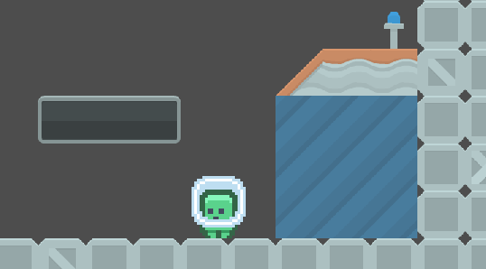
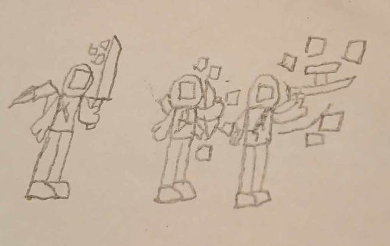
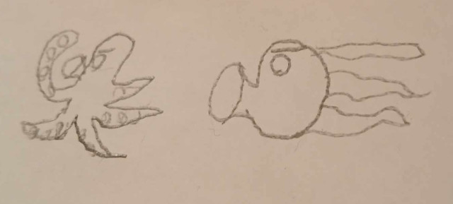

# coolest-project-2024

## Projekt leírása

Űrhajós játék, ahol az űrlényeket egy cellába kell juttatni, és különböző pályákon kell végigmenni. Az elején van egy kipróbálós pálya, ahol megismerkedhetsz a mechanikákkal. A játék Android telefonon játszható. Különböző fegyverek közül lehet választani: katana, íj, gépfegyver. Minden fegyver úgy van tervezve, hogy amit eltalálsz, az azonnal teleportál a börtön cellába. A fegyvereket az elején a gyakorló pályán kipróbálhatod.

## Mesélj nekünk a projektedről!

### Miért ezt a projektet készítetted el?
???

### Mi volt a legnagyobb nehézség a projekt elkészítése során és hogyan oldottad meg a felmerülő problémákat?
???

### Van bármi, amit másképp csinálnál, vagy amit még fejleszteni szeretnél a projekteden?
???

# Űrlény Teleportáló Játék

Üdvözlünk az **Űrlény Teleportáló Játékban**, egy izgalmas kalandban, ahol a célod, hogy az idegen lényeket teleportáld a börtöncellákba a különböző pályákon keresztül!

## 🛸 Játék Áttekintés

Ebben az űrben játszódó játékban az a feladatod, hogy az űrlényeket eljuttasd a kijelölt börtöncelláikba. Különböző pályákon kell végigmenned, beleértve egy **gyakorló pályát** is, ahol megismerkedhetsz az alapmechanikákkal.

### 🎮 Platform

- **Android**: A játék Android telefonokra készült, könnyen kezelhető, izgalmas mobiljáték.

## 🚀 Játék Funkciók

- **Gyakorló Mód**: Kezdd a gyakorló pályával, hogy megismerd a mechanikákat, mielőtt belemerülsz a fő küldetésekbe.
- **Fegyverválasztás**: Válassz a különböző fegyverek közül, mindegyik egyedi játékmenetet kínál:
  - **Katana**: Vágd át magad az akadályokon!
  - **Íj**: Célozz pontosan, és lődd el a nyilaidat!
  - **Gépfegyver**: Gyors tüzelés az űrlények elfogásához.

  *Minden fegyver úgy lett tervezve, hogy amit eltalálsz, az azonnal teleportál a börtöncellába!*

- **Teleportáló Mechanika**: A fő mechanika lényege, hogy ha eltalálod az űrlényeket a fegyvereddel, azok teleportálnak a börtöncellába.

## 🎯 Játékmenet

1. **Válassz Fegyvert**: Választhatsz Katana, Íj, vagy Gépfegyver közül.
2. **Teszteld a Gyakorló Pályán**: Válaszd ki a fegyveredet a gyakorló laborodban, hogy megismerd a működését.
3. **Űrlények Elfogása**: Menj végig a különböző pályákon, és fogd el az űrlényeket úgy, hogy eltalálod őket.
4. **Pályák Teljesítése**: Teleportáld sikeresen az összes űrlényt a cellába, hogy tovább léphess a következő pályára.

## 📱 Telepítés

A játék Android eszközökre érhető (majd) el. Töltsd le az itch.io oldalamról, és kezdj el játszani! 
> TODO: Link

## 🔧 Irányítás

- **Mozgás**: A jobbra és balra nyilakkal lehet sétálni.
- **Ugrás**: Az **A** gombbal tudsz ugrani.
- **Eszköz használata**: A **B** gombbal használhatsz eszközöket, például kinyithatod az ajtókat.
- **Támadás**: A joystickkal lőhetsz, vagy aktiválhatod a fegyverhez tartozó speciális támadási technikákat.

## 💡 Tippek

- Használd a gyakorló pályát, hogy megszokd a teleportáló mechanikát.
- Minden fegyvernek más-más erősségei vannak – találd meg, melyik illik a játékstílusodhoz!

## 📜 Licenc

Ez a projekt az MIT licenc alatt áll – további részletekért lásd a [LICENSE](LICENSE) fájlt.

## Fejlesztési környezet

Ez a projekt a **Godot Engine** használatával kerül megvalósításra.

---

Ha bármilyen javaslatod vagy ötleted van, nyiss egy hibajegyet vagy küldj be egy pull requestet!

## Felhasznált források

> TODO: modosítani, ha változik

- [Milos - Jumpy](https://github.com/milosfarkas/godot-jumpy)
- [Kenney - Platformer Industrial](https://kenney.nl/assets/platformer-pack-industrial)
- [Kenney - Platformer SciFi](https://kenney.nl/assets/ui-pack-sci-fi)
- [Kenney - Planets](https://kenney.nl/assets/planets)
- [Kenney - Platformer Industrial Expansion](https://kenney.nl/assets/pixel-platformer-industrial-expansion)
- [Kenney - Platformer Blocks](https://kenney.nl/assets/pixel-platformer-blocks)
- [Kenney - Platformer Redux](https://kenney.nl/assets/platformer-pack-redux)
- [Kenney - Platformer Art Requests](https://kenney.nl/assets/platformer-art-requests)
- [How to Create Melee Combat in Godot 4](https://www.youtube.com/watch?v=kPSyUEQds6M&ab_channel=MakerTech)
- [Godot Recipes: Melee Attack](https://www.youtube.com/watch?v=AaJopFFkmNo)