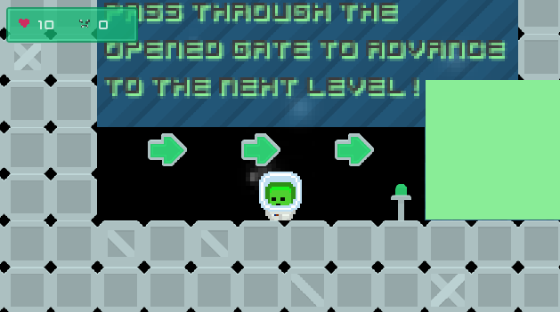
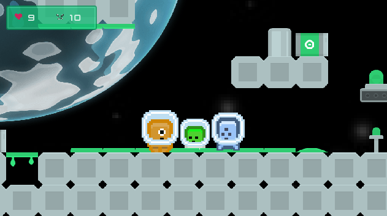
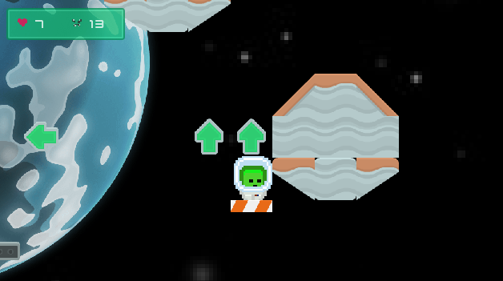

# Űrhajós Mr. Kicsi
`coolest-project-2024`

> [Próbáld ki a játékot az itch.io-n!](https://milosfarkas.itch.io/urhajos-mr-kicsi)  

## Projekt leírása

Az **Űrhajós Mr. Kicsi** egy űrlényekkel teli, izgalmas játék, ahol célod, hogy az idegen lényeket a börtöncellájukba teleportáld egy speciális lézerkatana segítségével. A pályákon végigmenve egyre nehezebb kihívásokkal nézel szembe.

## A projektről!

Az űrhajós Mr. Kicsi egy 2D platformer játék, 
amelyben az űrhajós Mr. Kicsi bolyong az űrben, 
és az űrlényeket a kijelölt cellákba teleportálja egy speciális lézerkatanával. 

### Miért ezt a projektet készítetted el?
Szerettem volna egy egyszerű 2D platformer játékot készíteni, amelyben specialis fegyverekkel lehet harcolni.

### Mi volt a legnagyobb nehézség a projekt elkészítése során, és hogyan oldottad meg a felmerülő problémákat?
A lézerkatanával való harc megvalósítása, a dash funkció volt a legnehezebb, de egy [Youtube videó segítségével](https://www.youtube.com/watch?v=kPSyUEQds6M) megoldottam.

### Van bármi, amit másképp csinálnál, vagy amit még fejleszteni szeretnél a projekteden?
- Szeretnék még több fegyvert hozzáadni a játékhoz.
- Menürendszert szeretnék hozzáadni a játékhoz.

## 🛸 Játék Áttekintés

Ebben az űrben játszódó játékban az a feladatod, hogy az űrlényeket a kijelölt cellákba juttasd. Kezdd a gyakorló pályával, és ismerd meg a játék alapmechanikáját, mielőtt a fő küldetésekbe belekezdesz.

### 🎮 Platform

- **Böngésző**: A játék böngészőben futtatható, mobilon és asztali gépen egyaránt.

## 🎯 Játékmenet

1. **Űrlények Elfogása**: Járd be a pályákat, és teleportáld az űrlényeket a cellákba.
2. **Pályák Teljesítése**: Az összes űrlényt sikeresen teleporáltad? Lépj tovább a következő pályára!

## 🔧 Irányítás

- **Mozgás**: A **jobbra** és **balra nyilakkal** sétálhatsz.
- **Ugrás**: A **FEL** gombbal ugráshoz.
- **Támadás**: A **Ctrl** gombbal használhatod a lézerkardot. Várj egy kis időt a következő támadás előtt.
- **Mobil Kontroller**: A **B** gombbal a mobil kontrollert megjelenítheted vagy elrejtheted.

## 📜 Licenc

Ez a projekt az MIT licenc alatt áll – további részletekért lásd a [LICENSE](LICENSE) fájlt.

## Fejlesztési környezet

A projekt a **Godot Engine** segítségével valósult meg.

---

Ha bármilyen javaslatod vagy ötleted van, kérlek, írd meg!

## Felhasznált források

- [Milos - Jumpy](https://github.com/milosfarkas/godot-jumpy)
- [Kenney - Platformer Industrial](https://kenney.nl/assets/platformer-pack-industrial)
- [Kenney - Platformer SciFi](https://kenney.nl/assets/ui-pack-sci-fi)
- [Kenney - Planets](https://kenney.nl/assets/planets)
- [Kenney - Platformer Industrial Expansion](https://kenney.nl/assets/pixel-platformer-industrial-expansion)
- [Kenney - Platformer Blocks](https://kenney.nl/assets/pixel-platformer-blocks)
- [Kenney - Platformer Redux](https://kenney.nl/assets/platformer-pack-redux)
- [Kenney - Platformer Art Requests](https://kenney.nl/assets/platformer-art-requests)
- [How to Create Melee Combat in Godot 4](https://www.youtube.com/watch?v=kPSyUEQds6M&ab_channel=MakerTech)

> ---

# Mr. Astro Junior  
`coolest-project-2024`  

> [Try the game on itch.io!](https://milosfarkas.itch.io/urhajos-mr-kicsi)  

  

## Project Description  

**Mr. Astro Junior** is an exciting 2D platformer game set in space. Your mission is to capture aliens and teleport them into prison cells using a special laser katana. As you progress through the levels, the challenges become increasingly difficult.  

  

## About the Project  

In this space-themed game, Mr. Astro Junior wanders through various levels, capturing aliens and safely teleporting them to their designated cells.  

  

### Why This Project?  
I wanted to create a simple yet engaging 2D platformer game featuring unique weapons and combat mechanics.  

### Biggest Challenge and Solution  
The most challenging part was implementing the laser katana's combat and dash functionality. I overcame this by following a [YouTube tutorial](https://www.youtube.com/watch?v=kPSyUEQds6M).  

### Future Plans  
- Add more weapons to the game.  
- Implement a robust menu system.  

## 🛸 Game Overview  

Your task is to capture aliens and teleport them into designated prison cells. Start with the practice level to get familiar with the mechanics, then dive into the main missions.  

### 🎮 Platform  

- **Browser**: Playable in browsers on mobile and desktop devices.  

## 🎯 Gameplay  

1. **Alien Capture**: Explore levels and teleport aliens into cells.  
2. **Level Completion**: Successfully capture all aliens to progress to the next level!  

## 🔧 Controls  

- **Movement**: Use the **left** and **right arrow keys** to walk.  
- **Jump**: Press the **UP arrow** to jump.  
- **Attack**: Use the **Ctrl key** to activate the laser sword; wait briefly before the next attack.  
- **Mobile Controller**: Toggle the mobile controller with the **B key**.  

## 📜 License  

This project is licensed under the MIT License – see the [LICENSE](LICENSE) file for details.  

## Development Environment  

The project was developed using **Godot Engine**.  

---  

If you have suggestions or ideas, feel free to share them!  

## Resources Used  

- [Milos - Jumpy](https://github.com/milosfarkas/godot-jumpy)  
- [Kenney - Platformer Industrial](https://kenney.nl/assets/platformer-pack-industrial)  
- [Kenney - Platformer SciFi](https://kenney.nl/assets/ui-pack-sci-fi)  
- [Kenney - Planets](https://kenney.nl/assets/planets)  
- [Kenney - Platformer Industrial Expansion](https://kenney.nl/assets/pixel-platformer-industrial-expansion)  
- [Kenney - Platformer Blocks](https://kenney.nl/assets/pixel-platformer-blocks)  
- [Kenney - Platformer Redux](https://kenney.nl/assets/platformer-pack-redux)  
- [Kenney - Platformer Art Requests](https://kenney.nl/assets/platformer-art-requests)  
- [How to Create Melee Combat in Godot 4](https://www.youtube.com/watch?v=kPSyUEQds6M&ab_channel=MakerTech)  
